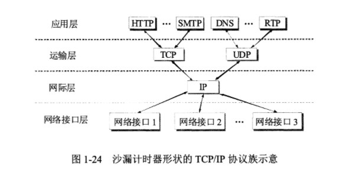
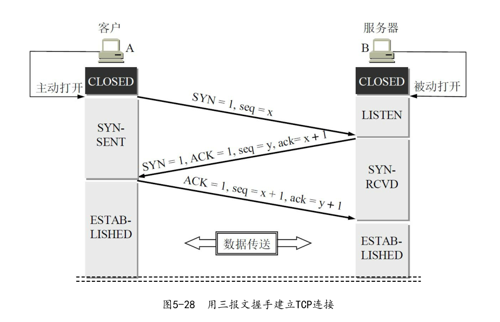
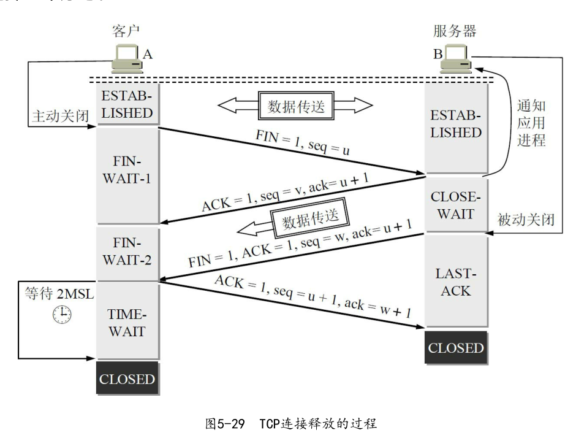
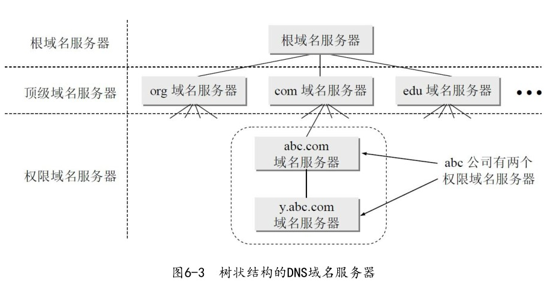

# 计算机网络八股文

## 网络七层协议

> 应用层
>
> 表示层
>
> 会话层
>
> 运输层
>
> 网络层
>
> 数据链路层
>
> 物理层

## 五层协议

去掉了`表示层`和`会话层`

* 表示层 :  信息的语法语义以及之间的关联
* 会话层: 不同机器的用户之间建立及管理会话

>应用层 ( 为特定应用程序提供数据传输服务 )
>
>传输层 ( 提供进程间的数据传输服务 )
>
>网络层 ( 提供主机之间提供数据传输服务 )
>
>数据链路层 ( 主机之间有很多链路, 数据链路层为同一链路的节点提供服务)
>
>物理层 (传输数据比特流, 屏蔽传输媒体和通信手段的差异 )

## TCP/IP

**IP协议**可以将异构的物理网络连接起来, 使得网络层看起来像是一个统一的网络

和**IP协议**配套使用的还有三个协议: 

1. 地址解析协议 ( ARP ):  实现由IP地址得到MAC地址.
2. 网络控制报文协议( ICMP )
3. 网络组管理协议( IGMP )

## 运输层: 提供进程间的逻辑通信

### TCP 和 UDP 区别

* **UDP** 面向无连接, 尽最大可能交付, 没有拥塞控制, 面向报文, 一对(一/多)
* **TCP** 面向连接, 提供可靠交付, 有流量控制, 拥塞控制, 面向字节流, 一对一

**UDP**首部8个字节: 

* 源端口
* 目标端口
* 长度: UDP 用户数据报的长度
* 检验和: 检测 UDP 用户数据报在传输中是否有出错

**TCP**首部20个字节:

* 源端口和目标端口
* 序号
* 确认号
* 数据偏移
* 保留
* 紧急URG
* 确认ACK
* 推送PSH
* 复位RST
* 同步SYN
* 终止FIN
* 窗口
* 检验和
* 紧急指针
* 选项

TCP 发送报文不关心应用进程一次把多长的报文发送到缓存,  而是根据**对方给出的窗口和当前网络拥塞的程度** 来决定一个报文段应包含多少个字节

UDP 是由应用进程给出

**TCP** 把**连接**作为最基本的抽象, 很多特性都与 `TCP面向连接` 这个基本特性有关

TCP 面向连接的 两个端点: 套接字

套接字Socket: (IP地址: 端口号)

*TCP*连接 = {socket1 : socket2} = {( IP1: PORT1 ), ( IP2: PORT2 )}

#### **TCP** 可靠传输的原理

IP 层 只能提供尽最大努力服务, 也就是**TCP**下面的网络提供的是不可靠传输

##### 停止等待协议

停止等待: 每发送完一个分组就停止发送, 等待对方的确认, 在收到确认后再发送一个分组

1.  无差错情况

2. 差错情况

   接收方接受某个分组`M1`出现差错, 就丢弃 `M1`,  其他的什么也不做(也不通知发送方收到了有差错的分组), 也可能是M1在传输过程中丢失了

   ------

   **可靠传输协议的设计**: 

   发送方只要超过一段时间仍然没有收到确认, 就认为刚发送的分组丢失了, 所以重传前面发送的分组, 这个叫做**超时重传**

   如何实现**超时重传**: 每次发送完一个分组 设置一个 **超时计时器**.

   在超时计时器到期时间之前收到了对方的确认, 就撤销已经设置的超时计时器

   超时计时器 设置的重传时间 应该比数据在分组传输的平均往返时间更长点 

------

3. 确认丢失 和 确认迟到

   情况1:

   若接收方 向发送方 发送 M1 的确认 丢失了,  发送方在设定的超时重传时间内没有收到确认, 此时 发送方并不知道是自己发送的分组 出错还是丢失了, 或者是 接收方 发送确认丢失了.

   发送方会重新传M1, 假定接收方 又收到了重传的分组M1, 这时候

   1. 丢弃这个重复的分组M1, 不想上层交付
   2. 向A发送确认

   情况2:

   若 接收方 向 发送方发送确认没有丢失, 而是因为网络问题迟到了, 发送方收到了重复的确认, 此时接收方仍然会收到重复的M1, 并且同样要丢弃重复的M1, 并重传确认分组

上述的确认 和 重传机制可以实现在不可靠的传输网络实现可靠的通信,  但是传输效率比较低, 所以采用**流水线传输**

使用流水线传输需要使用 **连续ARQ协议** 和 **滑动窗口协议**

### TCP流量控制

利用**滑动窗口**实现流量控制

**流量控制**: 让发送方的发送速率不要太快, 要让接收方来得及接受

==TODO==

### TCP拥塞控制

所谓拥塞控制就是防止过多数据注入到网络中, 这样可以使网络中的路由器或者链路不致过载

**拥塞控制**是一个全局性的过程, 涉及到整个网络

**流量控制**往往指的是 点对点通信量的控制, 是端到端的问题

流量控制所要做的是抑制发送方的发送速率

### 几种拥塞控制的方法

* 慢开始
* 拥塞避免
* 快重传
* 快恢复

发送方维持了一个拥塞窗口(`cwnd`)的状态变量, 拥塞窗口的大小取决于 网络的拥塞程度, 并且动态变化

#### 慢开始

由小到大逐渐增加发送窗口, 发送方收到确认后, 将自己的拥塞窗口`cwnd`加倍, 为了防止 `cwnd`过大, 需要设置一个 **慢开始门限**, 当拥塞窗口小于门限时, 使用**慢开始算法**, 大于时, 改用**拥塞避免算法**

#### 拥塞避免

让拥塞窗口缓慢的增大, 每次经过一个往返时间, 使发送方的拥塞窗口`cwnd`+1, 而不是加倍

无论是 慢开始 还是 拥塞避免, 只要发送方判断网络出现阻塞, 就要把 慢开始门限 设置为 出现拥塞时 发送窗口大小的一半, 然后将拥塞窗口设置为1, 执行慢开始

#### 快重传和快恢复

==TODO==

### TCP 三次握手 和 四次挥手

TCP 是面向连接的协议,  运输连接的建立和释放 是每一次面向连接的通信中必不可少的过程, 因此, 运输连接就有三个阶段, 即: **连接建立**, **数据传输** 和 **连接释放**

TCP 建立连接过程中需要解决三个问题:

1. 要使每一方能够确知对方的存在
2. 要允许双方协商一些参数
3. 能够对运输实体资源进行分配

#### TCP的连接建立(三次握手)

1. Client 向 Sever 发出请求报文段, 这时候首部的同步位SYN = 1, 同时选择一个 初始序列号 seq = x

   ​	此时 Client 进入 **同步已发送** 状态

2. Server 收到连接请求报文后, 如同意连接, 则向C发送确认, 确认报文中 SYN 和ACK 都置为 1, 此时确认号ack = x+1, 同时也为自己选择一个初始化序列号 seq = y

   ​	此时 Sever 进入 **同步收到** 状态

3. Client 收到 Sever 的确认后, 还要向 Server 给出确认, 确认报文 ACK 置为 1, 确认号ack = y+1, 而自己的序列号 seq = x+1

   ​	此时 Client进入 已建立连接状态, 当Server收到Client的确认后, 也进入已建立状态

   

第二次握手S 发送给 C 的报文段也可以拆成两个报文段: 可以先发送一个确认报文段(ACK=1, ack=x+1),  在发送一个同步报文段(SYN = 1, seq=y), 这样就变成了四次握手, 效果一样, 但是 效率就会降低

为什么 C 最后还要发送一次确认? 主要是为了防止已经失效的连接请求报文段突然又传送到了B, 从而产生错误.

**已经失效的连接请求报文段**?

若 C 发送的第一个报文段没有丢失, 而是在网络中滞留, 到连接释放以后才到达 S, 这是一个已经失效的报文段, 但 S 认为 发出了一次新的请求, 于是向A发出确认报文,同意进行连接, 若不采用 第三次握手来确认, 那么 S 发出确认,新的链接就建立了.

由于现在 C 并没有发出 建立连接的请求, 因此不会理会 S , 也不会向 S 发送数据, 而 S 却以为新的运输连接已经建立了, 并一直等待 C 发来数据, S 的许多资源就会被浪费

而采用三次报文握手的方法, 则可以防止上述现象的发生, 例如上述异常情况下, C 不会向S 的确认 向 S 发送确认, S收不到确认, 就知道 C并没有要求建立连接.

#### TCP的连接释放(四次挥手)

当数据传输结束后, 通信的双方都可以释放连接

1. C 的应用进程先向其 TCP 发出连接释放报文段, 并停止发送数据, 主动关闭 TCP 连接, C的首部 FIN=1, 序列号seq=u, 这时 C 进入 **终止等待1**状态

2. S 收到 连接释放报文段后发出确认, 确认号 ack=u+1, 而自己的序列号seq=v, 此时 S 进入 **关闭等待** 状态

   

   这时候 C 已经没有数据向 S 发送, 但若 B 还有数据要发送, C 仍要接收, 即 S -> C 方向的连接并没有关闭, TCP连接处于半关闭状态

   C 收到 S 的确认后, 就进入 **终止等待2**状态, 等待 S 发出连接释放报文, 

3. S 已经没有向C 发送数据, 此时 S 发出连接释放报文, FIN = 1, 由于又向C发送了一些数据, 此时 S 的 序列号为 w, 然后重复一次 已经发送过的确认号 ack= u+1, 然后进入 **最后确认状态**, 等待 C 的确认

4. C 收到了 S 的连接释放报文后, 必须对此发送确认, C的报文头部 ACK = 1, 确认号ack=w+1, 而自己的序列号 seq = u+1, 然后 进入 **时间等待状态**, 此时 TCP 连接没有释放掉, 等待2MSL(MSL: 最大报文段寿命, RFC 793规定为2分钟)

==为什么客户端在**时间等待状态**等待2MSL?==

1. 为了保证 C 发送的最后一个报文到达 S.  这个 ACK 报文段有可能丢失, 因此使得 处于 最后确认状态的服务器 S 收不到客户端 C 的确认报文而 超时重传这个报文, 而 C就能在2MSL时间内收到这个 重传的 报文段, 接着 C 重传一次确认, 重新启动 2MSL 计时器, 最后 C 和 S 都能正常进入到 CLOSED 状态.

   若C 在 时间等待状态 不等待一段时间, 而是在发送完 ACK报文段后直接释放连接, 那么就无法收到 S 重传的 FIN+ACK 报文段, 因而也不会重发一次确认报文段, 这样的话 S 就无法按照正常步骤 进入 关闭状态.

2. 防止 已经失效的连接请求报文段 出现在本次连接, C 发送完最后一个ACK报文段,  再经过2MSL, 就可以使本连接持续的时间内所产生的所有报文段都从网络中消失, 这样 下一次新的连接中就不会出现这种旧的连接请求报文段

## 应用层

运输层 为 应用提供端到端的通信服务, 但不同的网络应用的应用进程之间, 需要不同的通信规则. 因此在运输层协议之上, 还需要应用层协议, 每一个应用层协议都是为了解决某一类应用问题.应用进程之间的这种通信必须遵循严格的规则.

### 1. 域名系统DNS--从域名中解析出IP地址

#### 域名解析过程

1. 主机向本地域名服务器的查询一般采用**递归查询**: 若主机询问本地域名服务器不知道被查询域名的IP地址, 那么本地域名服务器就以DNS客户的身份向其他根域名服务器继续发出查询请求报文(替该主机继续查询), 而不是让该主机自己进行下一步的查询, 因此, **递归查询**返回的查询结果 要么是 要查询的 IP 地址, 要么报错 

2. 本地域名服务器向根域名服务器查询通常是采用**迭代查询**

   **迭代查询:** 根域名收到本地域名服务器发出的迭代查询请求报文后, 要么给出所要查询的IP地址, 要么告诉本地域名服务器应该向哪一个域名服务器进行查询, 然后让本地域名服务器进行后续查询, 最后 将结果返回给查询的主机

为了提高效率, 域名服务器中广泛使用了高速缓存, 存放最近查询过的域名以及从何处获得域名映射信息的记录

### 2. 万维网和HTTP协议, 以及万维网的两种不同的信息搜索引擎

------

FTP: 文件传送协议

使用TCP可靠的运输服务

FTP 服务器进程可以同时为多个客户端提供服务. 21端口为控制进程, 20端口为数据传输进程

FTP 服务器进程由两大部分组成: 

* 一个主进程, 负责接收 新的请求
* 若干从属进程, 负责处理单个请求

**主进程工作步骤:**

1. 打开 21 端口, 使客户端可以连接上
2. 等待客户进程发起连接请求
3. 启动从属进程处理客户进程发来的请求

使用两个独立的连接的主要好处是 使协议更加简单和容易实现, 同时在传输文件时还可以利用控制连接对文件的传输进行控制

------

**URL的格式**: <协议>://<主机>:<端口>/<路径>

现在最常用的协议是: **HTTP**

**HTTP**默认的端口号为 80

#### 超文本传输协议 HTTP

* HTTP使用了面向连接的TCP作为运输层协议, 保证数据的可靠传输

* HTTP 不必考虑数据在传输过程中被丢弃后又是怎样被重传

但是HTTP协议本身是无连接的, 虽然HTTP 使用了TCP连接, 但通信双方在交换HTTP报文之前不需要先建立HTTP连接.

HTTP协议是无状态的, 同一个客户端第二次访问同一个服务器的页面时, 服务器的响应与第一次被访问时的相同(若服务器还没有刷新)

HTTP协议首先要和服务器建立 TCP连接, 这时候需要三次握手, **当建立TCP连接的三次握手前两部分完成后**, 客户端就把**HTTP请求报文**作为第三次报文的**数据**发送给万维网服务器

##### HTTP/1.0缺点

* 每请求一个文档需要 2倍往返时间(2RTT), 一个往返时间用于TCP连接, 另一个往返时间用于请求和接收万维网文档

##### HTTP/1.1

* 使用持续连接: 服务器在发送响应后仍然在一段时间内保持这个连接

持续连接的方式:

1. 非流水线: 客户在收到前一个响应后才能发出下一个请求, 但服务器发送完一个对象后, 其TCP连接就处于空闲状态浪费服务器资源
2. 流水线: 客户端在收到HTTP响应报文之前还能够接着发送新的请求报文, 流水线的工作方式使得TCP空闲时间减少, 提高了下载文档的效率

### 3. 电子邮件的传输过程 SMTP协议 和 POP3协议, IMAP协议的使用场合

* 邮件发送协议 ( SMTP )
* 邮件读取协议( POP3 )

#### 4. 动态主机配置协议 DHCP 特点

* DHCP 客户使用的UDP端口是68

* DHCP 服务器使用的UDP端口是67

### 5.  网络管理的三个组成部分

### 6. 系统调用和应用编程接口的基本概念

### 7. P2P文件系统

