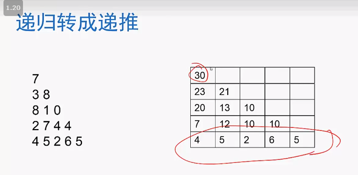

# 面试题01


> 给出了一个数字三角形。从三角形的顶部到底部有很多条不同路径。对于每条路径，把路径上面的数加起来可以得到一个和，你的任务就是找到最大的和。


> [数字三角形 - 动态规划（1） | Coursera](https://www.coursera.org/lecture/suanfa-jichu/shu-zi-san-jiao-xing-GIr6V)

## 递归

```go
func getMax(nums [][]int) int {
    if len(nums) == 0{
        return 0
    }
    
    return maxNumber(nums, 0, 0)
}


func maxNumber(nums [][]int, i, j int) int {
    if i == len(nums)-1 {
        return nums[i][j]
    }
    
    if maxNumber(nums, i+1, j) > maxNumber(nums, i+1, j+1) {
        return maxNumber(nums, i+1, j) + nums[i][j]
    }
    
    return maxNumber(nums, i+1, j+1) + nums[i][j]
}

```


```go
// 上面的方法 会一直递归调用 并且 重复的太多, 所以 可以考虑使用一块空间将结果保存起来
func getMaxBySlice(nums [][]int) int {
    if len(nums) == 0 {
        return 0
    }
    
    var result [][]int // 初始化一个二维数组, 值全为 -1
    for i := 0; i < len(nums); i++ {
        for j := 0; j < len(nums[i]); j++ {
            result[i][j] = -1
        }
    }
    
    return maxNumber(nums, result, 0, 0)
}

func maxNumber(nums, result [][]int, i, j int) int {
    if result[i][j] != -1 {
        return result[i][j]
    }
    
    if i == len(nums) -1 {
        result[i][j] = nums[i][j]
    }
    
    x := maxNumber(nums, result, i+1, j)
    y := maxNumber(nums, result, i+1, j+1)
    
    if x > y {
        result[i][j] = nums[i][j] + x
    } else {
        result[i][j] = nums[i][j] + y
    }
    
    return result[i][j]
}
```


## 动态规划

### "人人为我" 递推型动规



```go
func getMax(nums [][]int) int {
    var result [][]int // 开辟一个二维数组
    // 初始化
    for i:=0; i < len(nums); i++ {
        for j := 0; j<len(nums[i]) && i != len(nums)-1;j++ {
            result[i][j] = 0
        }
        
        for j := 0; j < len(nums[i]) && i == len(nums) -1; j++ {
            result[i][j] = nums[i][j]
        }
    }
    
    for i := len(nums)-2; i >= 0; i-- {
        for j := 0; j < len(nums[i]); j++ {
            result[i][j] = nums[i][j] + max(result[i+1][j], result[i+1][j+1])
        }
    }
    
	return result[0][0]
}
```


>  **实际上**, 从下往上走的话 `nums[i][j]` 只会被 `nums[i-1][j]`使用, 其他的地方也用不到了, 可以将`nums[i-1][j]` 最大和直接放在 `nums[i][j]`处

------

### 优化1, 将二维数组转换为一维数组

```go
func getMax(nums [][]int) int {
    var result []int
    
    // 初始化一个二维数组
    for i:=0; i < len(nums[len(nums)-1]); i++ {
        result = append(result, nums[len(nums)-1][i])
    }

    
    for i := len(nums)-2; i >= 0; i-- {
        for j := 0; j < len(nums[i]); j++ {
            result[i] = max(result[i], result[i+1]) + nums[i][j]
        }
    }
    
    return result[0]
}
```


### 优化2,  其实 可以 直接存到原二维空间最后一行

```go
func getMax(nums [][]int) int {
    for i := len(nums)-2; i >= 0; i-- {
        for j := 0; j < len(nums[i]); j++ {
            nums[len(nums)-1][j] = max(nums[len(nums)-1][j], nums[len(nums)-1][j+1]) + nums[i][j]
        }
    }
    
    return nums[len(nums)-1][0]
}

```


